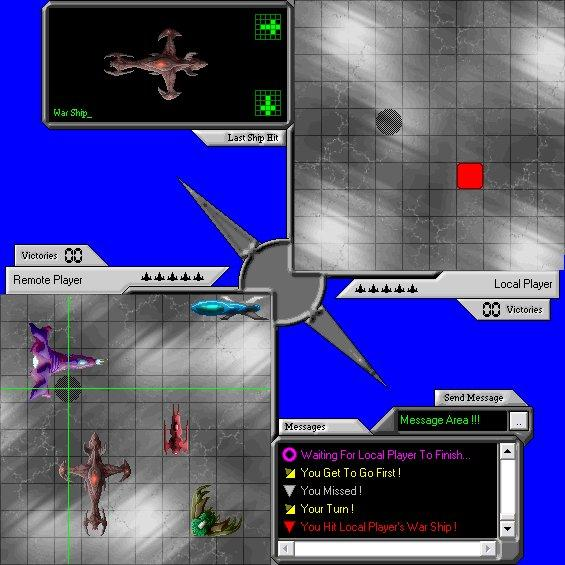



## Battle Star \(2 Players\)

### Description

This is like the game "Battle Ships" except it uses star ships of different shapes. Demonstrates BitBlt, Winsock & Simple Messaging Methods. Has been tested over the internet and Lan's. Just interested to find out what everyone thinks of this. This game is 100% complete !!!
 
### More Info
 
The program may take some time to load up, as it generates all the ships during startup.

             |
---                |---
**Submitted On**   |2002-12-20 22:43:36
**By**             |[Trevor Lewis](https://github.com/Planet-Source-Code/PSCIndex/blob/master/ByAuthor/trevor-lewis.md)
**Level**          |Intermediate
**User Rating**    |5.0 (35 globes from 7 users)
**Compatibility**  |VB 5\.0, VB 6\.0
**Category**       |[Games](https://github.com/Planet-Source-Code/PSCIndex/blob/master/ByCategory/games__1-38.md)
**World**          |[Visual Basic](https://github.com/Planet-Source-Code/PSCIndex/blob/master/ByWorld/visual-basic.md)
**Archive File**   |[Battle\_Sta15162312202002\.zip](https://github.com/Planet-Source-Code/trevor-lewis-battle-star-2-players__1-41744/archive/master.zip)

